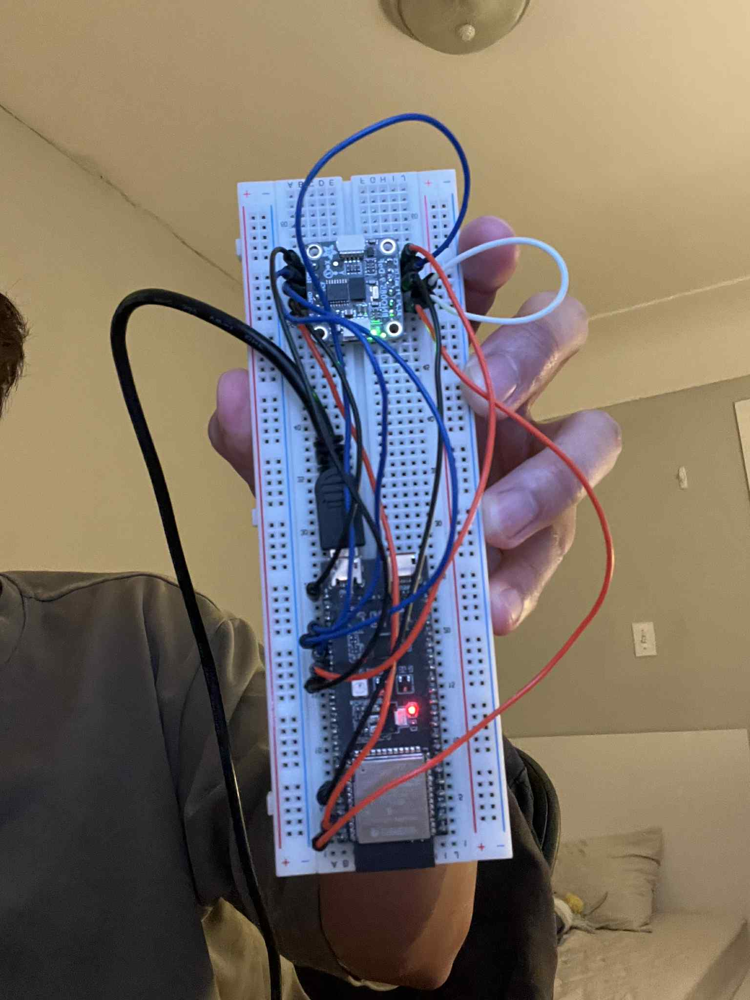
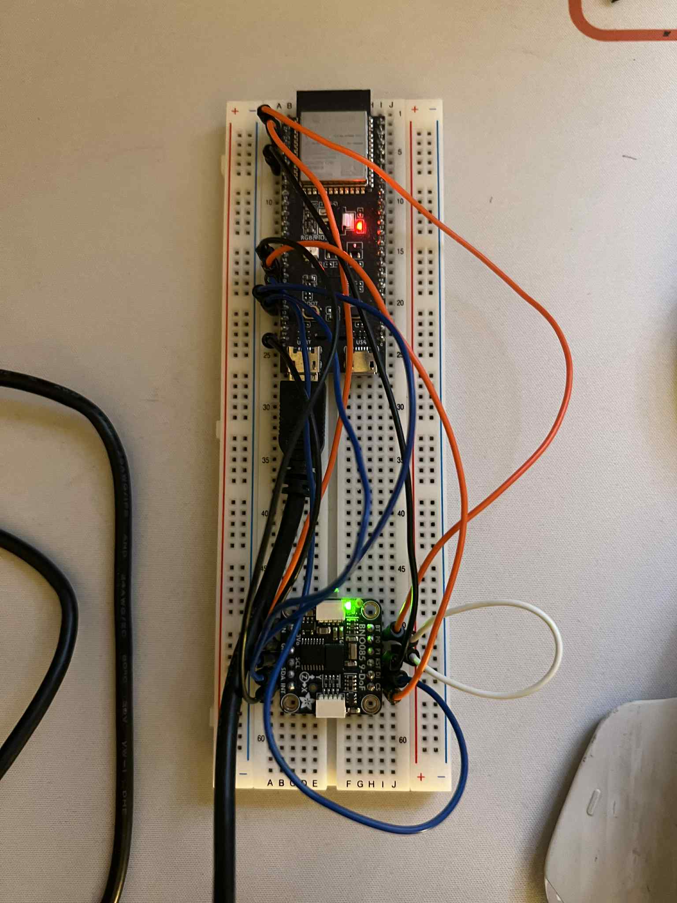

# imu-datasets
Paddle Stroke Data 

Current Available Datasets:

| File Name  | Description |
| ------------- | ------------- |
| 3_STROKES_20260129005923-imu_data.csv  | Pull Start, 3 Strokes  |
| 5_STROKES_20260129010003-imu_data.csv  | Pull Start, 5 Strokes  |
| 10_STROKES_20260129010037-imu_data.csv  | Pull Start, 10 Strokes |
| 25_SECONDS_20260129010131-imu_data.csv  | Pull Start, 25 Seconds of Strokes |
| 60_SECONDS_20260129010242-imu_data.csv  | Pull Start, 60 Seconds of Strokes  |

**Setup**

Captured with ESP32-S3 + BNO085 (9 DOF IMU)

Data Format: [time_seconds, acc_x, acc_y, acc_z, q_w, q_x, q_y, q_z]

**Orientation of Setup:**

Holding breadboard vertical + holes/wiring AWAY from me (i see the silver side/back of the breadboard)

Looking at actual axis of IMU from the strokers POV, it would be:

X = UP
Y = RIGHT
Z = AWAY FROM ME (Away from paddler)

**POV of you looking at me paddling + capturing dataset**
<video controls src="setup-images/paddling-dataset-clip_xpYt5xVM.mp4" title="Title"></video>

