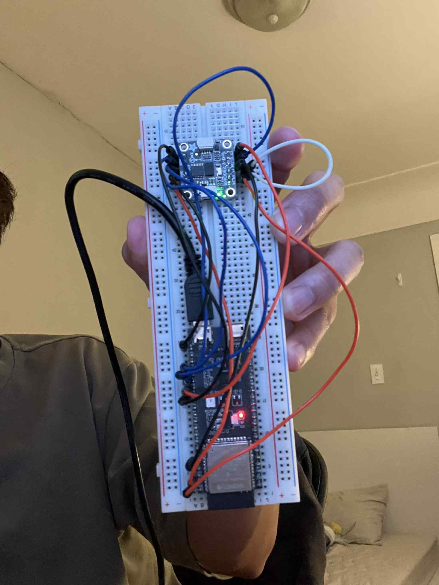
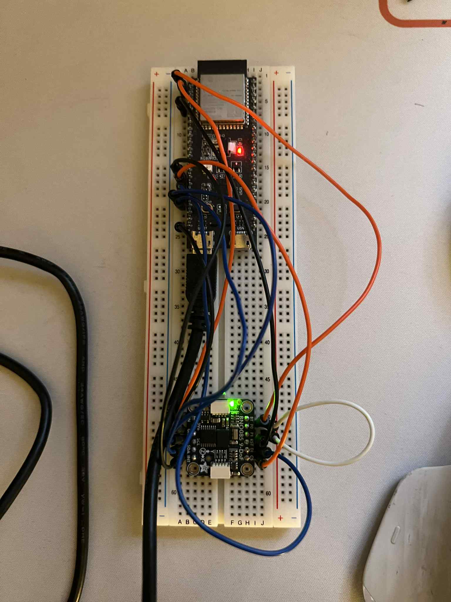

# imu-datasets
Paddle Stroke Data 

Current Available Datasets:

| File Name  | Description |
| ------------- | ------------- |
| 3_STROKES_20260129005923-imu_data.csv  | Pull Start, 3 Strokes  |
| 5_STROKES_20260129010003-imu_data.csv  | Pull Start, 5 Strokes  |
| 10_STROKES_20260129010037-imu_data.csv  | Pull Start, 10 Strokes |
| 25_SECONDS_20260129010131-imu_data.csv  | Pull Start, 25 Seconds of Strokes |
| 60_SECONDS_20260129010242-imu_data.csv  | Pull Start, 60 Seconds of Strokes  |

Water Datasets (/water_datasets) (Collected on March. 15 2026) (Aryan Paddling + Joe Collecting)

| File Name  | Description |
| ------------- | ------------- |
| slow_15_strokes.csv  | Pull Start, 15 Strokes, Slow Pace  |
| moderate_5_strokes.csv  | Pull Start, 5 Strokes, Moderate Pace  |
| moderate_10_strokes.csv  | Pull Start, 10 Strokes, Moderate Pace |
| fast_15_strokes.csv  | Pull Start, 15 Strokes, Fast Pace |
| moderate_13_strokes_32seconds.csv  | Pull Start, 32 Seconds of Strokes, 13 Strokes |

**Setup**

Captured with ESP32-S3 + BNO085 (9 DOF IMU)

Data Format: [time_seconds, acc_x, acc_y, acc_z, q_w, q_x, q_y, q_z]

**Water Dataset**

On March. 15, we collected Aryan's stroke data in the pool of DBAC. 

IMU + MCU + Breadboard was taped onto the paddle where the breadboard was facing AWAY from the paddler.

The script used to capture the data can be found in the csv_collection_update repo.

We also recorded b-roll footage (~20sec) of Aryan paddling.

**Orientation of Setup:**

Holding breadboard vertical + holes/wiring AWAY from me (i see the silver side/back of the breadboard)

Looking at actual axis of IMU from the strokers POV, it would be:

X = UP

Y = RIGHT

Z = AWAY FROM ME (Away from paddler)

**POV of you looking at me paddling + capturing dataset**

LOOK at VIDEO AT: imu-datasets\setup-images\paddling-dataset-clip_xpYt5xVM.mp4

<video controls src="setup-images/paddling-dataset-clip_xpYt5xVM.mp4" title="Title"></video>
